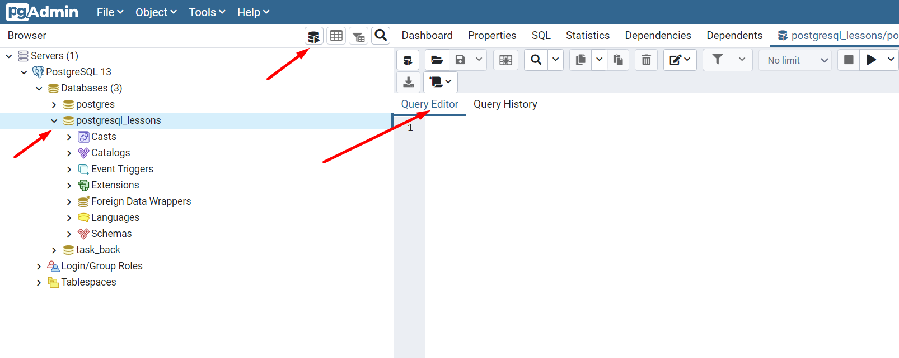
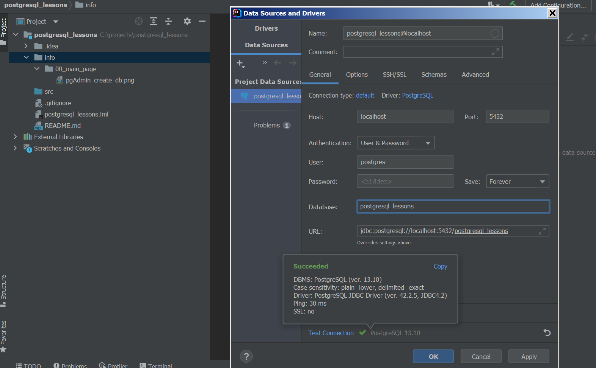

<h3> Кратко отдельные темы по PostgreSQL с примерами для начинающих </h3> 

Примечание: информация о проекте

Большая часть информация о проекте: примечания, описания, 
объяснения, картинки, комментарии находятся  
<a href="info">в папке info</a>. Много комментариев 
в самих файлах проекта. Скрипты sql находятся 
в соответствующих темах.

Инструменты

Windows 7 x64, Java 17  
PostgreSQL 13.10, pgAdmin v.4.30

Для начала работы

Вы можете создать базу данных в pgAdmin,
например postgres_lessons и прогонять скрипты
там  
  
или подключится к БД с помощью IDE и запускать скрипты
в ней после подключения  

Темы: 
~ <a href="/info/function/FUNCTION.md"> Функции - перейти в раздел</a> 
Определение функции, краткий синтаксис, скалярные функции,  
функции с входящими и исходящими аргументами, возврат множества строк  
функции с использованием PL/pgSQL, PL/pgSQL - возврат и присвоение,  
декларация переменных, if - else, циклы (while, loop, for), RETURN NEXT
  

Приведение типов  
SQL - строго типизированный язык. Разрешена перегрузка функций (разрешено 
иметь функции с одним именем, но с разным набором аргументов). Если типы между собой
совместимы - интерпритатор старается произвести неявное преобразование. 
Результат неявных преобразований всегда должен быть предсказуемым и понятным.  
Для явного преобразования используются:
CAST(expression AS target_type) - совместимо со стандартом SQL  
Краткая форма, не совместимая со стандартом: expression::target_type
Практическое применение преобразования типов
<a href="/info/cast/example.sql"> пример в SQL </a>
  

 

Примечание: спасибо

Спасибо вам за проявленный интерес к проекту. 
Вы можете склонировать данный проект, и оптимизировать его под свои нужды. 
Надеюсь проект дал вам что-то полезное.

