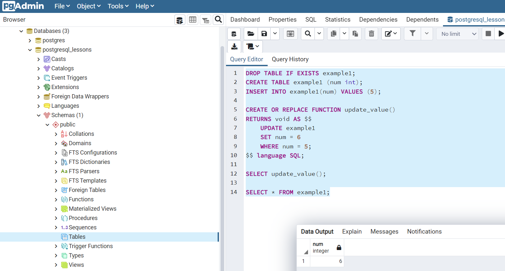
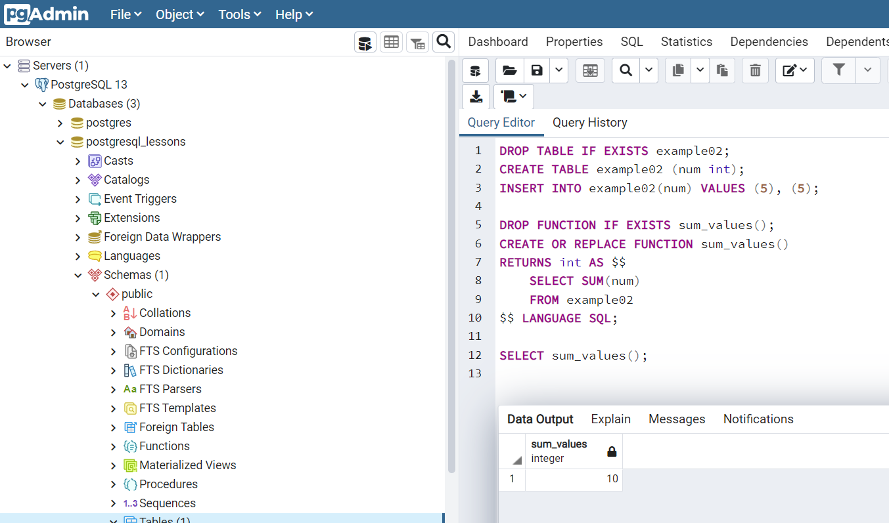
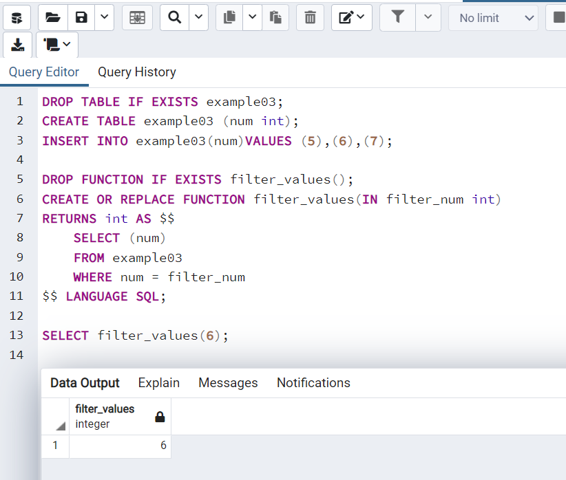
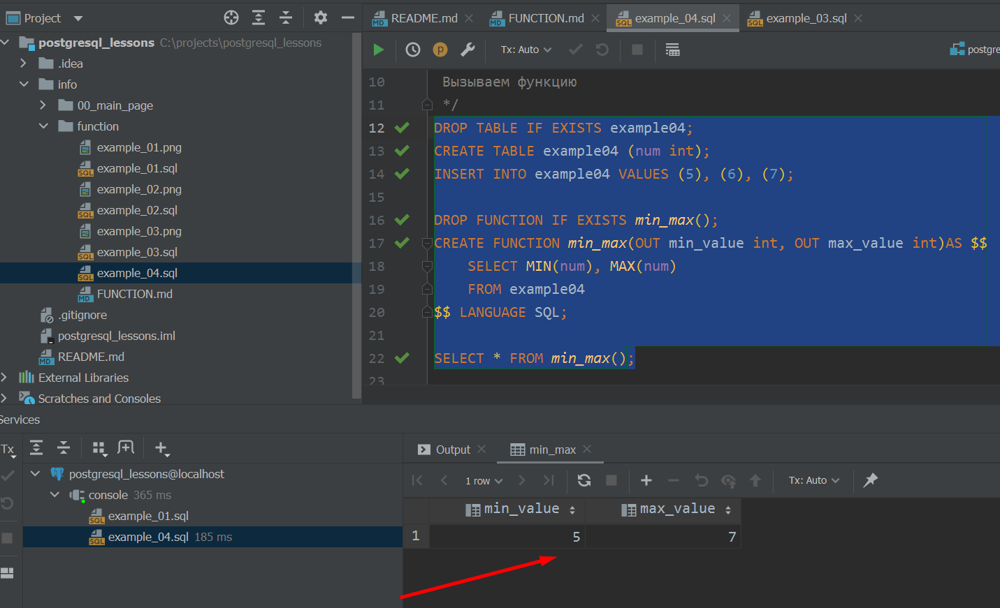
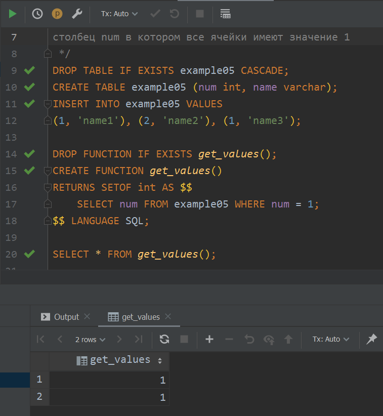
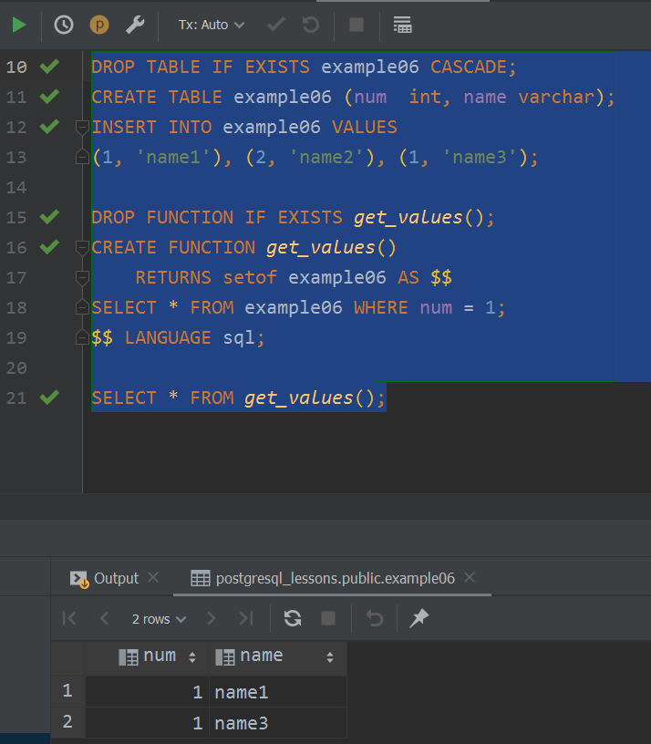

<a href="README.md">вернуться к оглавлению</a><br>

Тема: Функции <br><br>

**_Введение_**<br>
Функции - объект БД, принимающий аргументы и возвращающий результат.
Функции делятся на SQL - функции и процедурные - PL/pgSQL - основной диалект,
есть и другие, но это основные.<br><br>

**_Синтаксис:_**
```
CREATE FUNCTION func_name([arg1, arg2...]) 
RETURNS data_type AS $$
--logic
$$ LANGUAGE lang
```
Также можно использовать выражение CREATE OR REPLACE, и в такой форме используется чаще <br>
Пример 1. Использование простой функции (файл example_01.sql) в этой папке. В данном случае
используется дилект SQL (language SQL)
<details>
<summary>Результат выполнения в программе pgAdmin</summary>

</details>
<br>

**_Скалярные функции_**<br>
Скалярные функции в качестве возврата имеют единственное значение <br>
Пример 2. Использование скалярной функции (файл example_02.sql).
<details>
<summary>Результат</summary>

</details>
<br>

**_Функции с аргументами_**<br>
Аргументы которые мы получаем помечаются ключевым словом IN, 
исходящие аргументы - OUT, INOUT - входящие и исходящие аргументы, 
но их лучше не использовать, VARIADIC - массив входящих параметров, 
DEFAULT value - некоторым аргументам мы можем присваивать значения 
по умолчанию<br> 
Пример 3. Использование функции с входящими аргументами (example_03.sql)
<details>
<summary>Результат</summary>

</details>
Пример 4. Использование функции с исходящими аргументами (example_04.sql)
<details>
<summary>Результат выполнения скрипта в IDE</summary>

</details>

**_Возврат множества строк_**<br>
Есть несколько вриантов, среди них:<br>
~ RETURNS SETOF data_type - возврат n-значений типа data_type <br>
~ RETURNS SETOF table - если нужно вернуть все столбцы из таблицы<br>
~ RETURNS SETOF record - (только когда типы колонок неизвестны, 
желательно не использовать без необходимости)<br>
~ RETURNS TABLE (column_name data_type, ...) тоже самое, что и SETOF table,
но имеем возможность явно указать столбцы <br>
Пример 5. Использование функции RETURNS SETOF data_type (example_05.sql)
<details>
<summary>Результат выполнения скрипта в IDE</summary>

</details>
Пример 6. Использование функции RETURNS SETOF table (example_06.sql)
<details>
<summary>Результат выполнения скрипта в IDE</summary>

</details>
