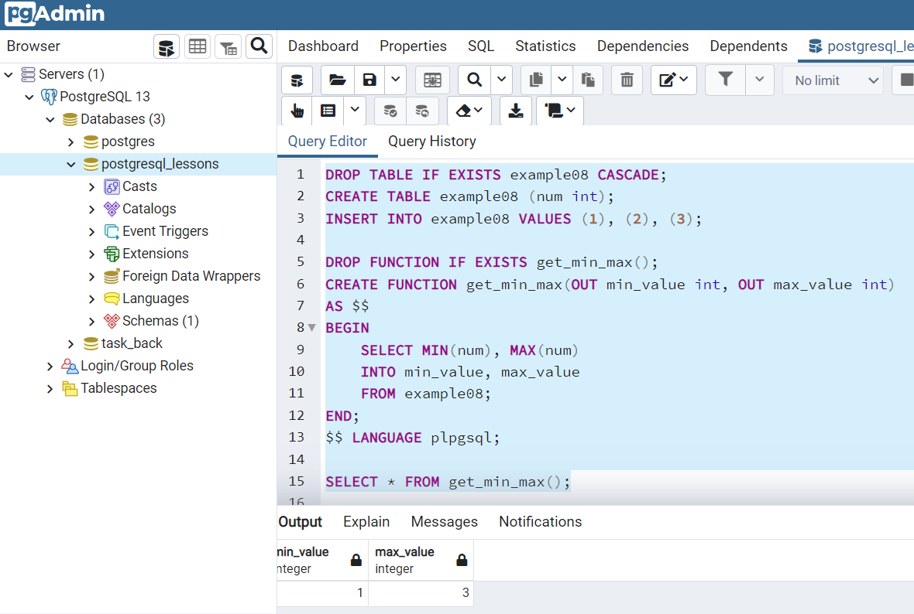

<a href="/README.md">вернуться к оглавлению</a><br>

Тема: Функции <br><br>

**_Введение_**<br>
Функции - объект БД, принимающий аргументы и возвращающий результат.<br>
Функции делятся на SQL - функции и процедурные - PL/pgSQL - основной диалект,
есть и другие, но это основные.<br><br>

**_Синтаксис:_**
```
CREATE FUNCTION func_name([arg1, arg2...]) 
RETURNS data_type AS $$
--logic
$$ LANGUAGE lang
```
Также можно использовать выражение CREATE OR REPLACE <br>
Пример 1. Использование простой функции <br>
(файл <a href="example_01.sql">example_01.sql</a>) в этой папке. <br>
В данном случае используется диалект SQL (language SQL)
<details>
<summary>Результат выполнения в программе pgAdmin</summary>

</details>
<br>

**_Скалярные функции_**<br>
Скалярные функции в качестве возврата имеют единственное значение <br>
Пример 2. Использование скалярной функции 
(файл <a href="example_02.sql">example_02.sql</a>).

<details>
<summary>Результат</summary>

</details>
<br>

**_Функции с аргументами_**<br>
Аргументы которые мы получаем помечаются ключевым словом IN, 
исходящие аргументы - OUT, INOUT - входящие и исходящие аргументы, 
но их лучше не использовать, VARIADIC - массив входящих параметров, 
DEFAULT value - некоторым аргументам мы можем присваивать значения 
по умолчанию<br> 
Пример 3. Использование функции с входящими аргументами 
(<a href="example_03.sql">example_03.sql</a>)

<details>
<summary>Результат</summary>

</details>
Пример 4. Использование функции с исходящими аргументами 
(<a href="example_04.sql">example_04.sql</a>)

<details>
<summary>Результат выполнения скрипта в IDE</summary>

</details> <br>

**_Возврат множества строк_**<br>
Есть несколько вриантов, среди них:<br>
~ RETURNS SETOF data_type - возврат n-значений типа data_type <br>
~ RETURNS SETOF table - если нужно вернуть все столбцы из таблицы<br>
~ RETURNS SETOF record - (только когда типы колонок неизвестны, 
желательно не использовать без необходимости)<br>
~ RETURNS TABLE (column_name data_type, ...) тоже самое, что и SETOF table,
но имеем возможность явно указать столбцы <br>
Пример 5. Использование функции RETURNS SETOF data_type 
(<a href="example_05.sql">example_05.sql</a>)

<details>
<summary>Результат выполнения скрипта в IDE</summary>

</details>

Пример 6. Использование функции RETURNS SETOF table 
(<a href="example_06.sql">example_06.sql</a>)

<details>
<summary>Результат выполнения скрипта в IDE</summary>

</details> <br>

**_Функции с использованием PL/pgSQL - введение_**<br>
Синтаксис:
```
CREATE FUNCTION func_name([arg1, arg2])
RETURNS data_type AS $$
BEGIN
--logic
END;
&& LANGUAGE plpgsql;
```
Особенности: <br>
~ BEGIN - END; - оборачивает тело метода <br>
~ plpgsql - можно создавать переменые - в SQL - нет <br>
~ прогон циклов, развитая логика, можно выбрасывать исключения <br>
~ возврат значений через RETURN (вместо SELECT) или RETURN QUERY
(в дополнение к SELECT) <br>

**_PL/pgSQL - возврат и присвоение_**<br>
Повторим скалярные функции, но уже с помощью plpgsql <br>
Пример 7. plpgsql сумма значений строк
(<a href="example_07.sql">example_07.sql</a>)
<details>
<summary>Результат выполнения скрипта в IDE</summary>

</details> <br>
Теперь повторим функции с исходящими аргументами, но тоже с plpgsql <br>
Пример 8. plpgsql функция с исходящими аргументами 
(<a href="example_08.sql">example_08.sql</a>)
<details>
<summary>Результат выполнения скрипта в pgAdmin</summary>

</details> <br>
Присвоение может выполняться 2 способами: <br>
result = x + y;<br>
result := x + y;<br>
Некоторые программисты считают что := более наглядно и 
улучшает читаемость кода <br>
Пример 9. plpgsql возвращаем RETURNS SETOF table <br>
(возврат множества строк с использованием RETURN QUERY)
(<a href="example_09.sql">example_09.sql</a>)
<details>
<summary>Результат выполнения скрипта в Idea</summary>

</details> <br>

**_PL/pgSQL - декларация переменных_**<br>
В рамках тела фунции могут быть объявлены различные переменные
с помощью DECLARE
```
CREATE FUNCTION func_name([arg1, arg2]) 
RETURNS data_type AS $$
    DECLARE 
        variable type;
BEGIN
--logic
END;
&& LANGUAGE plpgsql;
```
<br>

**_IF _ ELSE_**<br>
Синтаксис (наряду с ELSIF допустимо также ELSEIF):
```
IF expression THEN
    logic
ELSIF expression THEN
    logic
ELSEIF expression THEN
    logic
ELSE
    logiс
END IF                
```
Если в одном из блоков (IF или ELSEIF) выполняется условие - мы переходим
к ENDIF. Если ни одно из условий (IF или ELSEIF) не выполнено, включется
блок ELSE <br>
Для примера напишем функцию - конвертер температуры <br> 
Пример 10. Использование IF ELSE.
(<a href="example_10.sql">example_10.sql</a>)<br>

**_Цикл WHILE, LOOP, FOR_**<br>
Синтаксис WHILE <br>

```
WHILE expression 
--(выполняется, пока expression = true) 
LOOP 
    logic
END LOOP;    
```
Синтаксис LOOP <br>
```
LOOP 
    EXIT WHEN expresson
-- ( выходить, когда expresson = true)   
    logic
END LOOP;    
```
Синтаксис FOR <br>
```
FOR counter IN a..b [BY x]
--(counter (счетчик) IN (от) 1 до 5 BY (c шагом х))
LOOP
    logic
END LOOP;    
```
Конструкция CONTINUE WHEN используется, чтобы перейти на следующую итерацию кода, <br> 
EXIT - прервать цикл (аналог BREAK), REVERS - в обратном порядке <br>
Пример 10. Использование WHILE в числах Фибоначи.
(<a href="example_11.sql">example_11.sql</a>)<br>

**_RETURN NEXT_**<br>
Иногда необходимо накапливать записи в результирующем наборе (построчный процессинг)
Такое накопление делается выражением <br>
RETURN NEXT expression;<br>
Как правило обработка происходит в цикле. Такая обработка происходит довольно медленно,
желательно не использовать данное выражение
