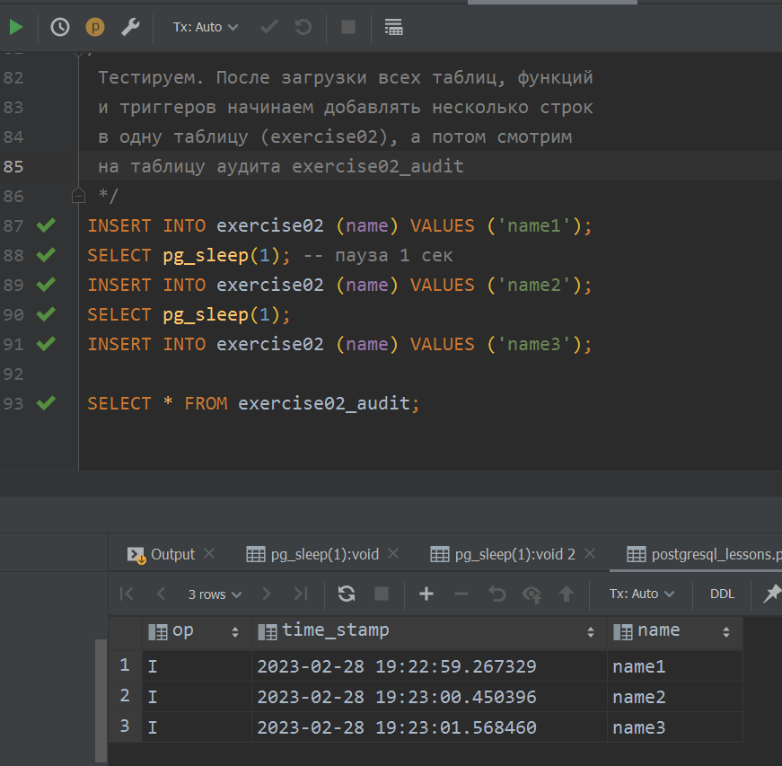

<a href="/README.md">вернуться к оглавлению</a><br>

Тема: Триггеры <br><br>

**_Построчный триггер_**<br>
Синтаксис для создания:<br>
(function_name() указывается какая функция будет работать с триггером)
```
CREATE TRIGGER trigger_name() condition ON table_name
FOR EACH ROW PROCEDURE function_name();
```
Condition:<br>
(BEFORE, AFTER)(INSERT, UPDATE, DELETE)<br>
Например:<br>
BEFORE INSERT, AFTER UPDATE, BEFORE INSERT OR UPDATE<br>

Привязка функции к триггеру (RETURNS trigger)
```
CREATE FUNCTION func_name RETURNS trigger AS $$
BEGIN
---
END 
$$ LANGUAGE plpgsql
```
Функция должна возвращать NULL или запись, соответствующую 
структуре таблицы, на которую будет вешаться триггер.<br>
Через аргумент NEW есть доступ к вставленным и модифицированным строкам
(INSERT/UPDATE триггеры). Через аргумент OLD есть доступ
к вставленным и удаленным строкам (UPDATE/DELETE триггеры)<br><br>

Практика по возврату из триггеров <br>
Функция должна возвращать NULL или запись, соответствующую
структуре таблицы, на которую будет вешаться триггер.<br>
Если BEFORE-триггер возвращает NULL, то сама операция и AFTER-триггеры 
будут отменены. BEFORE-триггер может изменить строку (INSERT/UPDATE) через
NEW и тогда операция и AFTER-триггеры будут работать с измененной строкой.
Если BEFORE-триггер "не хочет" изменять строку, то надо просто вернуть NEW.
В случае BEFORE-триггера, реагирующего на DELETE, возврат не имеет значения
(кроме NULL: отменит DELETE). NEW = null при DELETE, так что если BEFORE-триггер
хочет дат ход DELETE, то надо вернуть OLD. Возвращаемое значение из построчного 
AFTER-триггера (или из BEFORE и из AFTER триггеров на утверждения) игнорируется 
=> можно возвращать NULL. Если построчный AFTER-триггер или триггер на утверждение
"хочет" отменить операцию => raise exception <br> <br>

Практическое задание 1:
(файл <a href="exercise_01.sql">exercise_01.sql</a>)<br>
 Логгировать временную метку последнего изменения строки 
<details>
<summary>Результат теста в IDE</summary>

</details>

<br><br>
**_Триггер на утверждения_**<br>
Синтаксис для создания:<br>
```
CREATE TRIGGER trigger_name() condition ON table_name
REFERENCING [NEW, OLD] TABLES AS ref_table_name
FOR EACH STATEMENT EXECUTE PROCEDURE function_name();
```
Необходимо задекларировать референсную таблицу. В функции доступна переменная TG_OP,
хранящая тип операции (INSERT, UPDATE, DELETE). Такие триггеры часто используются
для настройки аудита.
<br><br>

**_Управление объектами триггеров_**<br><br>
Удаление триггера: <br>
DROP TRIGGER IF EXISTS ON table_name
<br><br>

Переименование триггера:<br>
ALTER TRIGGER trigger_name ON table_name <br>
RENAME TO new_trigger_name;
<br><br>

Отключение триггера:<br>
ALTER TABLE table_name <br>
DISABLE TRIGGER trigger_name;
<br><br>

Отключение всех триггеров на таблице:<br>
ALTER TABLE table_name <br>
DISABLE TRIGGER ALL;
<br><br>

Практическое задание 2:
(файл <a href="exercise_02.sql">exercise_02.sql</a>)<br>
Логгировать временную метку последнего изменения строки 
<details>
<summary>Результат теста в IDE</summary>

</details>